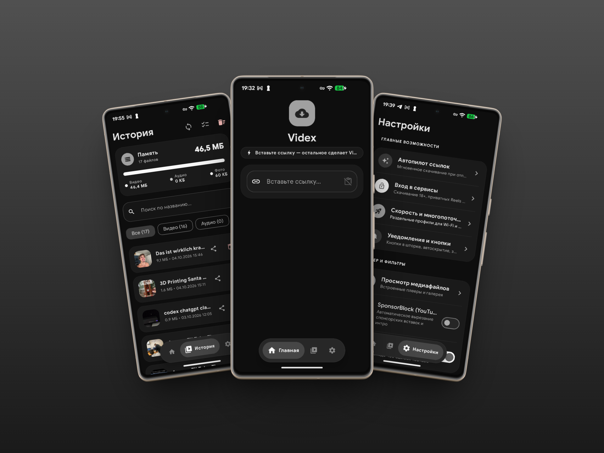

# Videx

**Videx** — современное open-source приложение для Android, предназначенное для скачивания видео, аудио и фото-каруселей с более чем 1000+ веб-сервисов. Работает полностью автономно: обработка и анализ ссылок происходят непосредственно на устройстве с помощью CPython 3.13 и `yt-dlp`.

<p align="center">
  
</p>

[Платформы](#поддерживаемые-платформы) • [Возможности](#ключевые-возможности) • [Алгоритмы](#умные-алгоритмы-и-оптимизация) • [Архитектура](#архитектура-и-технологический-стек) • [Сборка](#инструкция-по-сборке-из-исходников) • [Партнёры](#партнёр-проекта)

---

## Поддерживаемые платформы

> YouTube • Shorts • TikTok (без водяных знаков) • Instagram (Reels & Posts) • VK Видео • Клипы • Pinterest • X (Twitter) • Reddit • SoundCloud • Vimeo и ещё 1000+ сервисов.

---

## Ключевые возможности

<table>
<tr>
<td width="50%" valign="top">

### Загрузка медиаконтента
- **Максимальное качество**: Выбор видеопотоков до 4K/60FPS с сохранением оригинального битрейта.
- **Извлечение аудио**: Конвертация видеороликов в чистый MP3 или M4A звук.
- **Скачивание фото**: Автоматическое извлечение альбомов, каруселей и слайдшоу из TikTok и Instagram.
- **Пакетные и фоновые загрузки**: Скачивание через `WorkManager` с уведомлениями о прогрессе и ограничением параллельных потоков.

</td>
<td width="50%" valign="top">

### Встроенный видео- и аудиоплеер
- **Видеоплеер (Media3 ExoPlayer)**: Поддержка жестов яркости и громкости, перемотки 10 секунд двойным тапом, выбор соотношения сторон (Fit/Fill/Zoom) и режим «Картинка-в-картинке» (PiP).
- **Аудиоплеер**: Фоновое воспроизведение с обложками и управлением через уведомление `MediaSession`.

</td>
</tr>
<tr>
<td width="50%" valign="top">

### Автопилот и транзитный режим
- **Загрузка в один клик**: Нажмите «Поделиться» в любом приложении и выберите Videx — загрузка начнется автоматически.
- **Быстрая вставка**: Автоматическое обнаружение скопированной ссылки из буфера обмена.

</td>
<td width="50%" valign="top">

### Приватность и Безопасность
- **Локальный CPython**: Весь анализ и скачивание происходят на смартфоне, данные не отправляются на сторонние сервера.
- **Встроенный WebView**: Безопасная авторизация на сайтах через официальные веб-страницы для доступа к приватным подпискам.

</td>
</tr>
</table>

<details>
<summary><b>Настройка тактильного отклика и автообновления (нажмите для раскрытия)</b></summary>

- **Настройка тактильного отклика**: Выбор силы отклика (Мягкая, Стандартная, Сильная) и раздельное управление вибрацией для UI-кнопок, жестов видеоплеера и длинных зажатий.
- **Бесшовные обновления (OTA)**: Встроенная проверка новых релизов приложения на GitHub с возможностью скачивания и установки APK в один клик, а также автозагрузка свежих алгоритмов `yt-dlp` по воздуху.

</details>

---

<details>
<summary><b>Умные алгоритмы и техническая оптимизация (нажмите для раскрытия)</b></summary>

- **Алгоритм транзитного режима (Smart Transit)**: При отправке ссылки в Videx через системную кнопку «Поделиться» алгоритм оценивает параметры медиафайла и текущий тип сети (Wi-Fi или Mobile). Если включен автопилот, загрузка стартует мгновенно без открывания главного окна приложения.
- **Термальный троттлинг и управление CPU (Thermal Management)**: Интеграция с `PowerManager.OnThermalStatusChangedListener` позволяет отслеживать температуру процессора во время скачивания. При перегреве смартфона корутины вносят микро-задержки для охлаждения CPU и сохранения высокой плавности UI (60/120 FPS).
- **Самоисцеление истории (Self-Healing File Tracker)**: Записи в Room DB привязаны не только к прямому пути файла, но и к его цифровому отпечатку (Размер + Длительность медиа). Если файл переименован или перенесён пользователем через сторонний файловый менеджер, Videx автоматически восстанавливает привязку при следующем запуске.
- **Безопасное горячее обновление (Zero-Brick OTA)**: Механизм обновления Python-ядра использует атомарную замену файлов архива с созданием локального бэкапа (`ytdlp_backup.zip`). В случае обрыва сети или ошибки распаковки система мгновенно откатывается к рабочему ядру.
- **Адаптация буферов декодера (Exynos & Snapdragon Recovery)**: Во избежание зависания видеокадров при быстрой перемотке плеер приостанавливает декодирование кадров на время движения ползунка, исключая аппаратные сбои видеодрайвера.

</details>

---

## Архитектура и технологический стек

| Компонент | Используемые технологии |
| :--- | :--- |
| **Язык программирования** | Kotlin (JDK 17) |
| **Пользовательский интерфейс** | Jetpack Compose, Material 3 Expressive, Dynamic Colors |
| **Архитектура** | MVVM, ViewModels, StateFlow, Coroutines |
| **Медиаплеер** | AndroidX Media3 ExoPlayer, MediaSession |
| **База данных** | Room Database (SQLite v5 с автомиграциями) |
| **Фоновые задачи** | AndroidX WorkManager (Expedited DataSync Workers) |
| **Python-движок** | Chaquopy (CPython 3.13, `yt-dlp`, `requests`) |
| **Сеть и кэш** | OkHttp 4, Coil (Video & Image Disk Cache) |

---

<details>
<summary><b>Инструкция по сборке из исходников (нажмите для раскрытия)</b></summary>

### Требования
- Android Studio Ladybug (2024.2.1) или новее
- JDK 17
- Android SDK 36 (minSdk 26, targetSdk 36)

### Сборка Release APK
Для сборки готового к установке APK-файла выполните команду в консоли:

```bash
./gradlew assembleRelease
```

Готовый файл будет находиться по пути:
`app/build/outputs/apk/release/app-release.apk`

</details>

---

## Установка готового приложения

Вы можете скачать готовый файл **`app-release.apk`** из официального раздела **[GitHub Releases](https://github.com/xzl1te26-code/Videx/releases)**.

---

## Партнёр проекта

Приложение **Videx** создано при поддержке команды **ProxyGuide Team** — экспертов в области приватности и безопасности.

- **Сообщество ProxyGuide**: [@ProxyGuide_Community](https://t.me/ProxyGuide_Community)
- **Telegram-бот**: [@ProxyGuidebot](https://t.me/ProxyGuidebot)

---

## Сообщество и Поддержка

- **Telegram-канал**: [@videx_app](https://t.me/videx_app)
- **Чат поддержки**: [@videx_chat](https://t.me/videx_chat)

---

## Лицензия

Проект распространяется под лицензией **MIT**. Подробности см. в файле [LICENSE](LICENSE).
